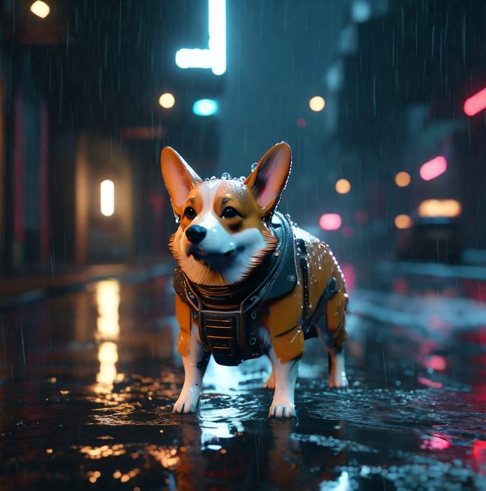
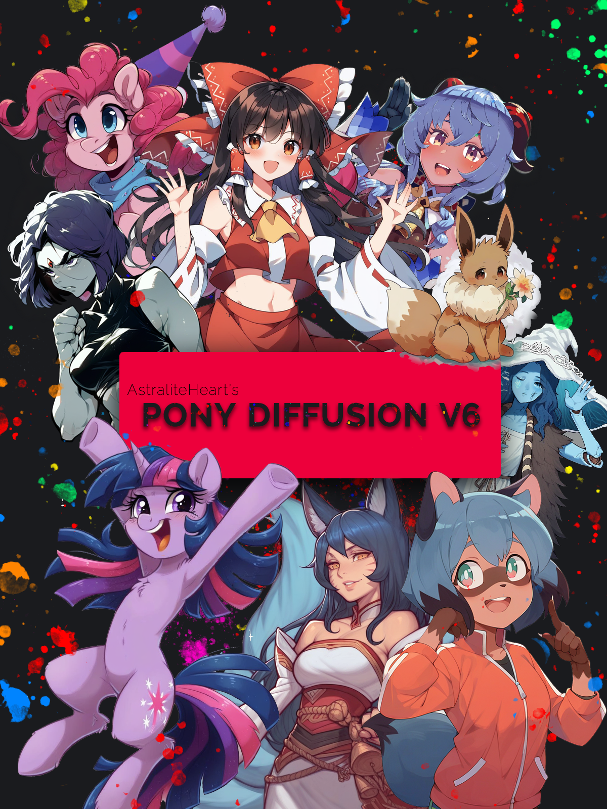
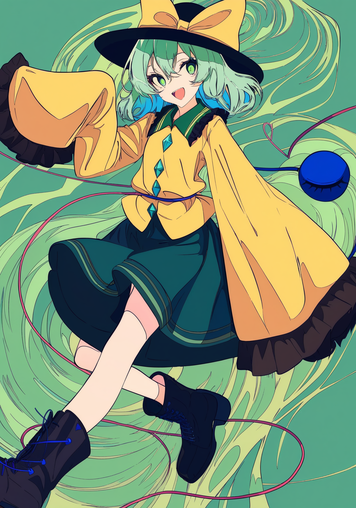

# 训练使用的模型说明
该文档仅介绍 [SD Trainer Installer](https://github.com/licyk/sd-webui-all-in-one/blob/main/sd_trainer_installer.md) 中模型下载器内可下载的模型。

## 已有模型
在 SD Trainer Installer 的模型下载器中，可下载以下的模型。

|模型名称|模型类型|
|---|---|
|[v1-5-pruned-emaonly](https://huggingface.co/runwayml/stable-diffusion-v1-5)|SD 1.5|
|[animefull-final-pruned](https://huggingface.co/NovelAI/nai-anime-v1-full)|SD 1.5|
|[v2-1_768-ema-pruned](https://huggingface.co/stabilityai/stable-diffusion-2-1)|SD 2.1|
|[wd-1-4-anime_e2](https://huggingface.co/hakurei/waifu-diffusion-v1-4)|SD 2.1|
|[wd-mofu-fp16](https://huggingface.co/waifu-diffusion/wd-1-5-beta3)|SD 2.1|
|[sd_xl_base_1.0_0.9vae](https://huggingface.co/stabilityai/stable-diffusion-xl-base-1.0)|SDXL|
|[animagine-xl-3.0](https://civitai.com/models/260267?modelVersionId=293564)|SDXL|
|[animagine-xl-3.1](https://civitai.com/models/260267/animagine-xl-v31)|SDXL|
|[kohaku-xl-delta-rev1](https://civitai.com/models/332076/kohaku-xl-delta)|SDXL|
|[kohakuXLEpsilon_rev1](https://civitai.com/models/399873?modelVersionId=445973)|SDXL|
|[kohaku-xl-epsilon-rev2](https://civitai.com/models/399873)|SDXL|
|[kohaku-xl-epsilon-rev3](https://huggingface.co/KBlueLeaf/Kohaku-XL-Epsilon-rev3)|SDXL|
|[kohaku-xl-zeta](https://huggingface.co/KBlueLeaf/Kohaku-XL-Zeta)|SDXL|
|[ponyDiffusionV6XL_v6](https://civitai.com/models/257749/pony-diffusion-v6-xl)|SDXL|
|[pdForAnime_v20](https://civitai.com/models/315596/pd-for-anime)|SDXL|
|[starryXLV52_v52](https://civitai.com/models/448552/starry-xl-v52)|SDXL|
|[heartOfAppleXL_v20](https://civitai.com/models/272440?modelVersionId=337306)|SDXL|
|[heartOfAppleXL_v30](https://civitai.com/models/272440)|SDXL|
|[Illustrious-XL-v0.1](https://huggingface.co/OnomaAIResearch/Illustrious-xl-early-release-v0)|SDXL|
|[Illustrious-XL-v0.1-GUIDED](https://huggingface.co/OnomaAIResearch/Illustrious-xl-early-release-v0)|SDXL|
|[flux1-schnell](https://huggingface.co/black-forest-labs/FLUX.1-schnell)|FLUX.1|
|[flux1-schnell-fp8](https://huggingface.co/Comfy-Org/flux1-schnell)|FLUX.1|
|[flux1-dev](https://huggingface.co/black-forest-labs/FLUX.1-dev)|FLUX.1|
|[flux1-dev-fp8](https://huggingface.co/Comfy-Org/flux1-dev)|FLUX.1|
|[vae-ft-ema-560000-ema-pruned](https://huggingface.co/stabilityai/sd-vae-ft-ema-original)|SD 1.5 VAE|
|[vae-ft-mse-840000-ema-pruned](https://huggingface.co/stabilityai/sd-vae-ft-mse-original)|SD 1.5 VAE|
|[sdxl_fp16_fix_vae](https://huggingface.co/madebyollin/sdxl-vae-fp16-fix)|SDXL VAE|
|[sdxl_vae](https://huggingface.co/stabilityai/sdxl-vae)|SDXL VAE|
|[ae](https://huggingface.co/black-forest-labs/FLUX.1-schnell)|FLUX.1 VAE|
|[clip_l](https://huggingface.co/comfyanonymous/flux_text_encoders)|FLUX.1 CLIP|
|[t5xxl_fp16](https://huggingface.co/comfyanonymous/flux_text_encoders)|FLUX.1 CLIP|
|[t5xxl_fp8_e4m3fn](https://huggingface.co/comfyanonymous/flux_text_encoders)|FLUX.1 CLIP|

>[!NOTE]  
>animefull-final-pruned 模型被标注为 SD 1.5 的模型，实际上该模型的版本为 Stable Diffusion 1.4，但是 Stable Diffusion 1.4 和 Stable Diffusion 1.5 的差距并不是很大，基于 Stable Diffusion 1.4 训练出来的 LoRA 模型同样可在 Stable Diffusion 1.5 上正常使用。

## 模型类型
上述的模型中被标记了不同的类型，以下为不同类型的说明。

|模型类型|描述|
|---|---|
|SD 1.5|模型的版本为 Stable Diffusion 1.5|
|SD 2.1|模型的版本为 Stable Diffusion 2.1|
|SDXL|模型的版本为 Stable Diffusion XL|
|SD 1.5 VAE|模型为 Stable Diffusion 1.5 的其中一个组件，即 VAE|
|SDXL VAE|模型为 Stable Diffusion XL 的其中一个组件，即 VAE|

常用的模型版本为 1.5 和 XL，很少使用 2.1。Stable Diffusion 2.1 因为其中的文本编码器（CLIP）存在严格的过滤规则，可能会影响在某些提示词下的出图效果，所以使用 Stable Diffusion 2.1 的人相对较少，基于 Stable Diffusion 2.1 进行训练的模型也比较少。

如果需要训练 Stable Diffusion 1.5 的 LoRA 模型，选择 Stable Diffusion 1.5 模型进行训练。如果需要训练 Stable Diffusion 1.5 的 LoRA 模型，选择 Stable Diffusion 1.5 模型进行训练。注意，基于 Stable Diffusion 1.5 训练的 LoRA 模型不能在 Stable Diffusion XL 模型上使用，基于 Stable Diffusion XL 训练的 LoRA 模型也同理。

VAE 为 Stable Diffusion 模型的其中一个组件，通常情况下 Stable Diffusion 模型都会包含 VAE（个别 Stable Diffusion 模型会把 VAE 移除，一般在这种模型的下载页中都会有相关的说明），所以一般不需要下载。但是在训练模型时（通常是训练 SDXL 的 LoRA 模型时），可能需要下载 VAE 进行使用。因为在使用 Stable Diffusion XL 模型训练 LoRA 时，Stable Diffusion XL 内置的 VAE 在 FP16 精度下可能无法正常工作，出现黑图（在 VAE 编 / 解码时出现 NaN）的情况，这时候需要下载修复版的 VAE（在模型列表中为 sdxl_fp16_fix_vae）替换掉模型中原有的 VAE 进行使用。

## 模型选择
训练 Stable Diffusion 1.5 的 LoRA 模型时 Stable Diffusion 1.5 模型进行训练。训练 Stable Diffusion 1.5 的 LoRA 模型时选择 Stable Diffusion 1.5 模型进行训练。

要训练 LoRA 模型时，需避免使用融合模型，尽量选择训练模型。

训练所使用的模型尽量选择与训练集的风格相似的。

假设训练出来的 LoRA 模型想在 A 模型上使用，而 A 模型基于 B 模型进行训练，如果 LoRA 模型是在 B 模型上进行训练，则 LoRA 模型在 A 模型和 B 模型上的表现效果都会比较不错。简单来说就是尽量选择上游的模型进行训练会得到较好的兼容性，前提是 A 模型并没有在 B 模型的基础上进行大量的训练。

>[!NOTE]  
>融合模型是指通过将不同的模型按照一定的比例进行融合，最终得到的模型即为融合模型。训练模型是指在非融合模型的基础上进行训练得到的模型。SD Trainer Installer 提供的模型下载器中，提供的模型均为训练模型。

在 Stable Diffusion 1.5 中，训练出的模型通常具有较高的兼容性，因为在模型站上很多的模型具有同一个根。比如模型站上许多的二次元风格的 Stable Diffusion 1.5 模型都具有同一个根，NovelAI 1。因此，基于 NovelAI 1 训练的 LoAR 模型在这些模型上都会有较好的表现。

但在 Stable Diffusion XL 上，因为模型的制作从以前的融合模型改为了训练模型（虽然在模型站上仍然能够看到 Stable Diffusion XL 的融合模型），在 Stable Diffusion XL 官方模型的基础上进行大量训练，并且不同模型的训练素材也不一样，所以造成了 LoRA 模型在这个模型上的表现不错，但是在另一个模型上的表现就不行了，也就是兼容性不行~~（毕竟基于 Stable Diffusion Xl 训练的 NovelAI 3 并没有遭到泄露，没得模型融了）~~。

所以在 Stable Diffusion XL 上追求 LoRA 模型的兼容性意义不大，所以如果打算在哪个模型上使用 LoRA 模型，在训练 LoRA 模型时就选择那个模型作为训练所使用的模型。如果所使用的模型 A 在上游模型 B 进行少量的训练，则在上游模型 B 训练的 LoRA 模型在模型 A 和上游模型 B 上的表现都会比较好，也就是表现出了兼容性。

## 模型介绍

### Stable Diffusion 1.5 官方模型
>[!NOTE]  
>对应模型列表中的 [v1-5-pruned-emaonly](https://huggingface.co/runwayml/stable-diffusion-v1-5)。

该模型为 StabilityAI 官方制作的模型，出图的画风大多为真实系，适合训练真实系的 LoRA 模型。

||||
|---|---|---|

### NovelAI 1
>[!NOTE]  
>对应模型列表中的 [animefull-final-pruned](https://huggingface.co/NovelAI/nai-anime-v1-full)。

该模型为 NovelAI 公司公开的 1 代模型，模型基于 Stable Diffusion 1.4 官方模型进行训练（使用该模型训练得到的 LoRA 模型可在 Stable Diffusion 1.5 上使用），特化了模型对二次元风格的表现，适合训练二次元风格的 LoRA 模型。

||||
|---|---|---|

### Stable Diffusion 2.1 官方模型
>[!NOTE]  
>对应模型列表中的 [v2-1_768-ema-pruned](https://huggingface.co/stabilityai/stable-diffusion-2-1)。

该模型为 StabilityAI 官方制作的模型，出图的画风大多为真实系，适合训练真实系的 LoRA 模型。相比于 Stable Diffusion 1.5，使用的训练集分辨率从 512 x 512 改为了 768 x 768，提高了模型在高分辨率下的出图效果，但是由于文本编码器（CLIP）存在严格的过滤规则，可能会导致部分提示词下的出图效果不好，不建议使用。

||||
|---|---|---|

### Waifu Diffusion
>[!NOTE]  
>对应模型列表中的 [wd-1-4-anime_e2](https://huggingface.co/hakurei/waifu-diffusion-v1-4)、[wd-mofu-fp16](https://huggingface.co/waifu-diffusion/wd-1-5-beta3)。

模型基于 Stable Diffusion 2.1 进行训练，特化了二次元风格的表现。由于文本编码器（CLIP）存在严格的过滤规则，可能会导致部分提示词下的出图效果不好，不建议使用。

||||
|---|---|---|

### Stable Diffusion XL 官方模型
>[!NOTE]  
>对应模型列表中的 [sd_xl_base_1.0_0.9vae](https://huggingface.co/stabilityai/stable-diffusion-xl-base-1.0)。

该模型为 StabilityAI 官方制作的模型，使用了 1024 x 1024 分辨率的训练集进行训练，使模型可以在更高的分辨率下进行生成，效果更好。同时模型支持更多的风格，泛化性相比于 Stable Diffusion 1.5 / Stable Diffusion 2.1 有了较大的提升，可通过提示词调整出图的风格。如果需要训练真实系风格的 LoRA 模型，推荐使用该模型作为训练时使用的模型。

||||
|---|---|---|

### Animagine XL 3
>[!NOTE]  
>对应模型列表中的 [animagine-xl-3.0](https://civitai.com/models/260267?modelVersionId=293564)、[animagine-xl-3.1](https://civitai.com/models/260267/animagine-xl-v31)。

该模型基于 Stable Diffusion XL 上训练，使用大量不同二次元风格的图片进行训练，特化了二次元风格的出图效果，并且能够通过提示词调整出不同二次元风格的图片，属于 XL 二次元三巨头之一。训练二次元风格的 LoRA 模型时推荐使用该模型作为训练使用的模型。

||||
|---|---|---|

### Kohaku XL
>[!NOTE]  
>对应模型列表中的 [kohaku-xl-delta-rev1](https://civitai.com/models/332076/kohaku-xl-delta)、[kohakuXLEpsilon_rev1](https://civitai.com/models/399873?modelVersionId=445973)、[kohaku-xl-epsilon-rev2](https://civitai.com/models/399873)、[kohaku-xl-epsilon-rev3](https://huggingface.co/KBlueLeaf/Kohaku-XL-Epsilon-rev3)、[kohaku-xl-zeta](https://huggingface.co/KBlueLeaf/Kohaku-XL-Zeta)。

该模型基于 Stable Diffusion XL 上训练，使用大量不同二次元风格的图片进行训练，特化了二次元风格的出图效果，可通过提示词调整出不同的二次元画风，模型在画龙娘方面特别擅长，属于 XL 二次元三巨头之一。训练二次元风格的 LoRA 模型时推荐使用该模型作为训练使用的模型。

||||
|---|---|---|

### Pony Diffusion XL
>[!NOTE]  
>对应模型列表中的 [ponyDiffusionV6XL_v6](https://civitai.com/models/257749/pony-diffusion-v6-xl)。

该模型基于 Stable Diffusion XL 上训练，使用大量不同二次元风格的图片进行训练，特化了二次元风格的出图效果，该模型在人物动作上具有很好的表现效果，属于 XL 二次元三巨头之一。训练二次元风格的 LoRA 模型时可使用该模型作为训练使用的模型。

>[!WARNING]  
>因为该模型在训练方法上的问题，使用该模型进行训练时，训练参数不能使用在其他模型上的经验进行调整，如学习率需要比其他模型更高。所以在对训练 LoRA 不熟悉时，不建议从该模型入手。

||||
|---|---|---|

### PD For Anime
>[!NOTE]  
>对应模型列表中的 [pdForAnime_v20](https://civitai.com/models/315596/pd-for-anime)。

该模型基于 Pony Diffusion XL 进行训练，优化了 Pony Diffusion XL 在二次元画风上的表现，增加了更多的画风。训练二次元风格的 LoRA 模型时可使用该模型作为训练使用的模型。

>[!WARNING]  
>因为该模型基于 Pony Diffusion XL，使用该模型进行训练时，训练参数不能使用在其他模型上的经验进行调整，如学习率需要比其他模型更高。所以在对训练 LoRA 不熟悉时，不建议从该模型入手。

||||
|---|---|---|

### Starry XL
>[!NOTE]  
>对应模型列表中的 [starryXLV52_v52](https://civitai.com/models/448552/starry-xl-v52)。

该模型基于 Kohaku XL Epsilon Rev 1 进行训练，优化了 Kohaku XL Epsilon 的人物动作的表现，并在原来的基础上增加了更多的画风，并且相比原有的能够支持直出更多的 IP 角色。训练二次元风格的 LoRA 模型时可使用该模型作为训练使用的模型。

||||
|---|---|---|

### Heart Of Apple XL
>[!NOTE]  
>对应模型列表中的 [heartOfAppleXL_v20](https://civitai.com/models/272440?modelVersionId=337306)、[heartOfAppleXL_v30](https://civitai.com/models/272440)。

Heart Of Apple XL 2 基于 Animagine XL 3 进行训练，Heart Of Apple XL 3 基于 Kohaku XL Epsilon 进行训练，在原有的增加更多的画风和更多的角色。训练二次元风格的 LoRA 模型时可使用该模型作为训练使用的模型。

||||
|---|---|---|

### Illustrious XL
>[!NOTE]  
>对应模型列表中的 [Illustrious-XL-v0.1](https://huggingface.co/OnomaAIResearch/Illustrious-xl-early-release-v0)、[Illustrious-XL-v0.1-GUIDED](https://huggingface.co/OnomaAIResearch/Illustrious-xl-early-release-v0)。

Illustrious XL 基于 Kohaku XL Beta rev5 进行训练，使用完整的 Danbooru 图集作为训练集进行训练，拥有强大画面表现效果，可直出多种 IP 角色 / 不同画风，是新的 XL 二次元巨头，社区版 NovelAI 3。

||||
|---|---|---|

### FLUX.1
>[!NOTE]  
>对应模型列表中的 [flux1-schnell](https://huggingface.co/black-forest-labs/FLUX.1-schnell)、[flux1-schnell-fp8](https://huggingface.co/Comfy-Org/flux1-schnell)、[flux1-dev](https://huggingface.co/black-forest-labs/FLUX.1-dev)、[flux1-dev-fp8](https://huggingface.co/Comfy-Org/flux1-dev)。

FLUX.1 由 Black Forest Labs 工作室制作，模型拥有更强的语义理解能力，画面的表现效果更强，但同时对设备的性能要求更高。

||||
|---|---|---|

### VAE
>对应模型列表中的 [vae-ft-ema-560000-ema-pruned](https://huggingface.co/stabilityai/sd-vae-ft-ema-original)、[vae-ft-mse-840000-ema-pruned](https://huggingface.co/stabilityai/sd-vae-ft-mse-original)、[sdxl_fp16_fix_vae](https://huggingface.co/madebyollin/sdxl-vae-fp16-fix)、[sdxl_vae](https://huggingface.co/stabilityai/sdxl-vae|)，[ae](https://huggingface.co/black-forest-labs/FLUX.1-schnell)。

VAE 模型为 Stable Diffusion 中的其中一个组件，通常来说只有在训练 Stable Diffusion Xl 的 LoRA 模型时才需要到 sdxl_fp16_fix_vae，因为模型自带的 VAE 在 FP16 的精度下可能会出现 NaN，这是可通过改用 BF16 精度进行训练，如果显卡不支持 BF16 精度，则通过外挂 sdxl_fp16_fix_vae 这个修复版 VAE 进行训练。

如果要训练 FLUX 模型，需要外挂 FLUX 的 VAE。

### CLIP
>[!NOTE]  
>对应模型列表中的 [clip_l](https://huggingface.co/comfyanonymous/flux_text_encoders)、[t5xxl_fp16](https://huggingface.co/comfyanonymous/flux_text_encoders)、[t5xxl_fp8_e4m3fn](https://huggingface.co/comfyanonymous/flux_text_encoders)。

训练 FLUX 模型时需要外挂 CLIP。