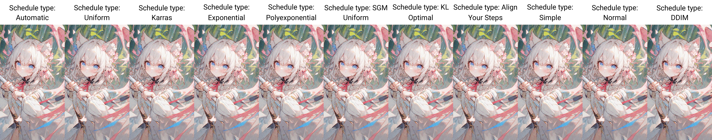
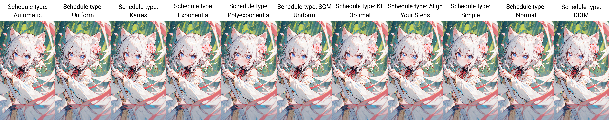

# 采样算法对比
## 简介
对不同采样算法和采样算法的调度器做个简单的对比

## 参数
- 正向提示词
```
1girl,cherry blossoms,hair flower,hair ribbon,cat ears,animal ear fluff,blue eyes,grey hair,short hair,bangs,hair between eyes,eyebrows visible through hair,blush,open mouth,light smile,neck ribbon,white sleeveless dress,crease,frilled_collar,detached_sleeves,flat chest,legs,
upper body,looking at viewer,sitting near river,hand on own chest,fist,
outdoors,flower,day,tree,grass,bridge,river,road,water,nature,sun,field,
foot out of frame,close-up,from_above,
```

- 反向提示词
```
nsfw,lowres,bad anatomy,bad hands,text,error,missing fingers,extra digit,fewer digits,cropped,worst quality,low quality,normal quality,jpeg artifacts,signature,watermark,username,blurry,bad feet,
```

- 提示词引导系数：7
- CLIP 停止层数：2
- 分辨率：1024x768
- 采样步数：20
- 种子：743776728
- 大模型：[cetusMix_Whalefall2](https://civitai.com/models/6755?modelVersionId=105924)
- VAE 模型：[vae-ft-mse-840000-ema-pruned](https://huggingface.co/stabilityai/sd-vae-ft-mse-original/blob/main/vae-ft-mse-840000-ema-pruned.ckpt)
- SD WebUI 版本：v1.9.0-15-gff6f4680
- 测试的采样算法：
  - DPM++ 2M
  - DPM++ SDE
  - DPM++ 2M SDE
  - DPM++ 2M SDE Heun
  - DPM++ 2S a
  - DPM++ 3M SDE
  - Euler a
  - Euler
  - LMS
  - Henu
  - DPM2
  - DPM2 a
  - DPM fast
  - DPM adaptive
  - Restart
  - DDIM
  - PLMS
  - UniPC
  - LCM
  - Euler_Dy
  - Eular_Max
  - Eular_Smea_Dy
  - Eular_Smea
- 测试的调度器：
  - Uniform
  - Karras
  - Exponential
  - Polyexponential
  - SGM Uniform

>[!NOTE]  
>`Euler_Dy`，`Eular_Max`，`Eular_Smea_Dy`，`Eular_Smea`采样算法需安装 [advanced_euler_sampler_extension](https://github.com/licyk/advanced_euler_sampler_extension) 扩展

## 对比图
- DPM++ 2M


- DPM++ SDE


- DPM++ 2M SDE


- DPM++ 2M SDE Heun


- DPM++ 2S a


- DPM++ 3M SDE


- Euler a


- Euler


- LMS


- Henu


- DPM2


- DPM2 a


- DPM fast


- DPM adaptive


- Restart


- DDIM


- PLMS


- UniPC


- LCM


- Euler_Dy


- Eular_Max


- Eular_Smea_Dy


- Eular_Smea


***

2024.6.9

在 SD WebUI 的 dev 分支更新了 KL Optimal 和 Align Your Steps 调度器后，对我常用的算法测试了一遍效果。

- Restart


- UniPC


- Euler_Dy_Negative


- Euler_Smea_Dy


- DPM++ 2M SDE


- Euler a


- Heun


- DPM++ 2M SDE Heun


***

2024.7.6

SD WebUI 更新了 DDIM CFG++ 采样器和 Simple、Normal、DDIM 调度器，顺手测试了一下效果。

- DDIM CFG++


- TCD


- Euler_Dy_Negative


- Euler_Negative


- Euler_Smea_Dy


- UniPC


- Restart


- DPM++ 2M SDE


- Euler a


- DPM++ 2M SDE Heun


- Heun
