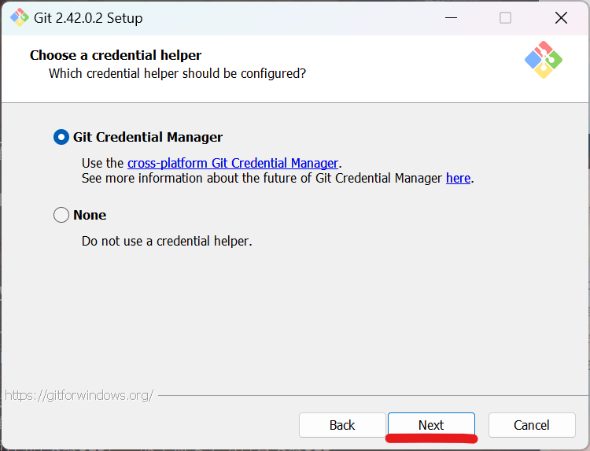
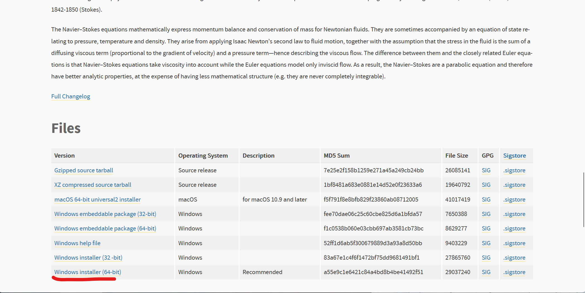
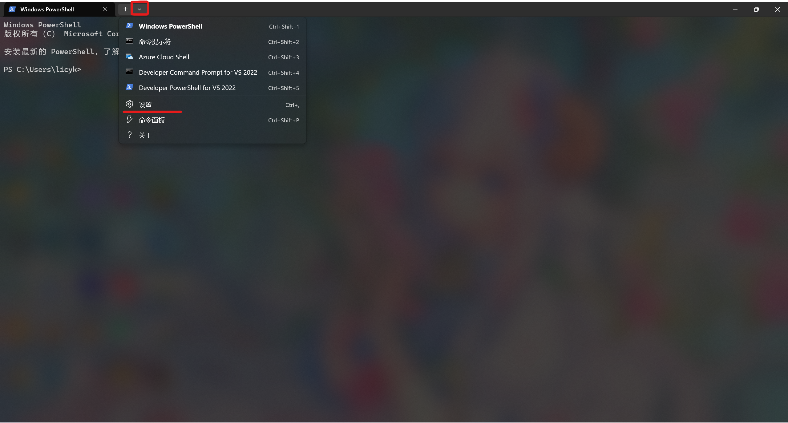
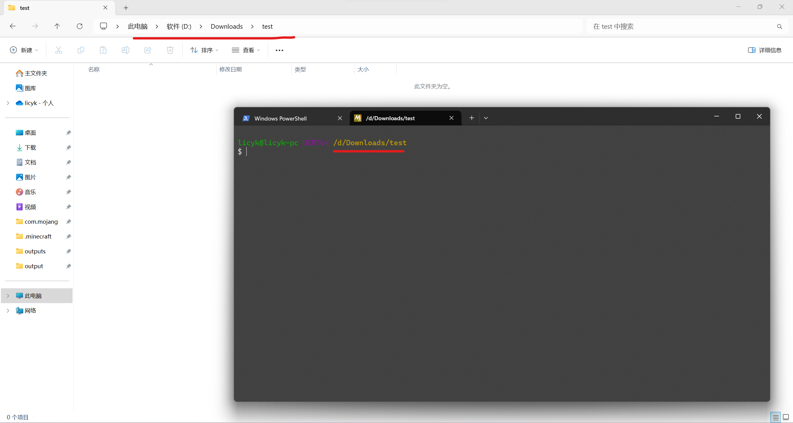
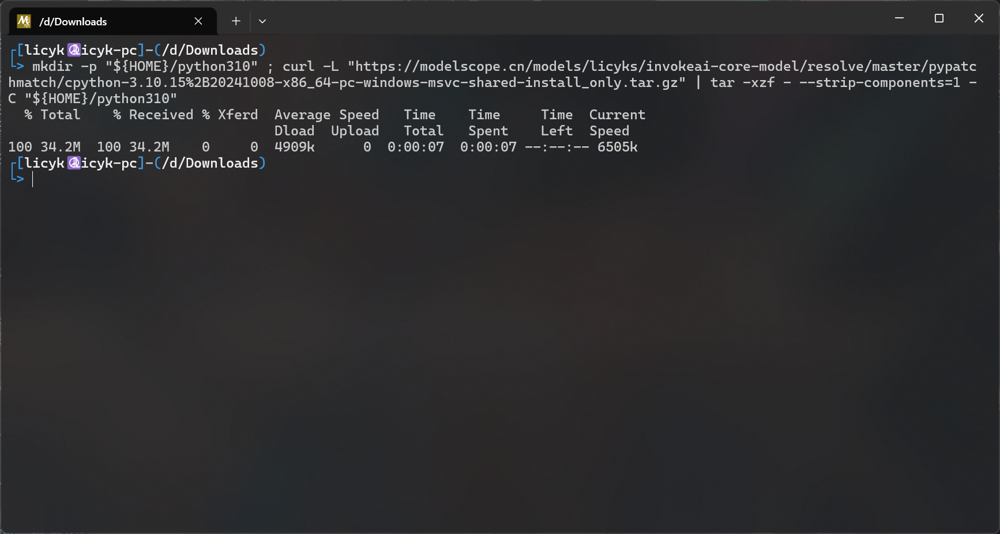
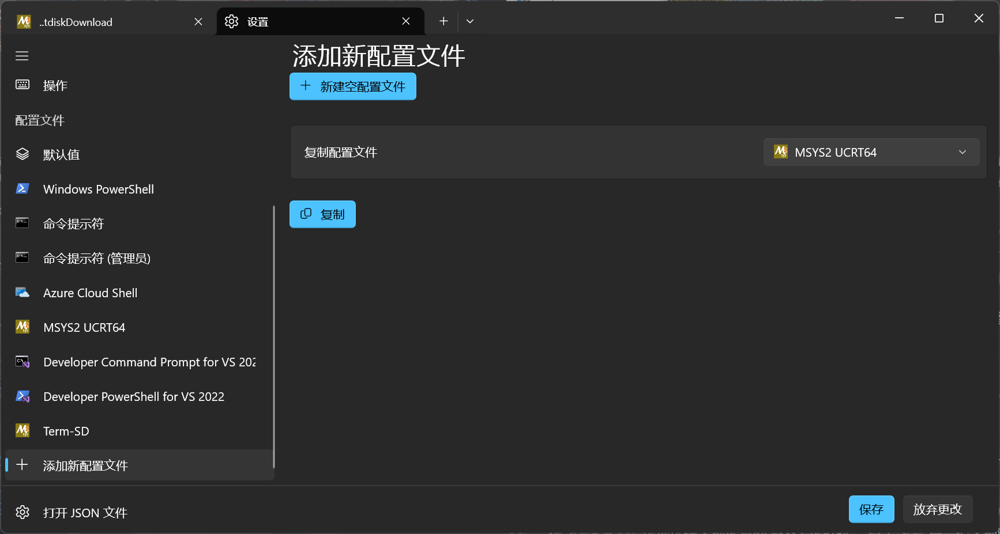

## Windows系统安装配置环境的方法：  

### 1、安装msys2  
进入[msys2官网](https://www.msys2.org/)  
在官网`Installation`找到`1、Download the installer:`，点击右边的按钮进行下载并安装  

&nbsp;
<div align="center">

  
`msys2下载页面`  
  
`安装界面`  
  
`先选择安装路径,再点下一步`  
  
`直接下一步`  
  
`安装过程`  

</div>

### 2、安装git  
进入[git官网](https://git-scm.com/download/win)  
在Download for Windows页面找到`64-bit Git for Windows Setup.`，点击下载  
打开git安装包，在安装界面自己选择要安装的位置，选择好后一直点击下一步，直至安装完成  

&nbsp;
<div align="center">

  
`官网下载地址`  
  
`安装界面`  
  
`先选择安装路径，再点Next`  
  
`一直点Next`  
  
  
  
  
  
  
  
  
  
  
  
  
  
`点Install就开始安装了`  

</div>

### 3、安装python，pip  
进入[python官网](https://www.python.org/downloads/release/python-31011/)    
在python3.10的页面找到`Windows installer (64-bit)`，点击下载  
打开python安装包，在安装界面点击`customize installation`，然后点击`next`，勾选`Add Python to environment variables`，再点击`browse`，自己选择要安装的位置，选择好后点击`install`，等待安装完成  
安装结束前先不要关闭安装界面，先点击`Disable path length limit`，再退出  
>python安装器在安装python时同时安装pip，一般不需要手动再去安装pip

&nbsp;
<div align="center">

  
`官网下载地址`  
  
`安装界面`  
  
  
`先选择安装路径，然后勾选Add Python to environment variables，再点Next`  
  
`点击Disable path length limit(没有该选项时则不用理会)`  

</div>

### 4、安装aria2  
前往[aira2官网](http://aria2.github.io/)  
点击`Download version`进入下载页面，找到`aria2-xx版本-win-64bit-build1.zip`点击下载，解压得到`aria2c.exe`
在系统的某个位置创建一个文件夹，得到一个路径，比如D:\Program Files\aria2，记下来，将aria2c.exe放入文件夹  
按下“win+R”快捷键，打开运行对话框，输入指令：  

    sysdm.cpl

打开`系统属性`窗体后，依次点击选项卡`高级`->`环境变量`  
在`系统变量`部分点双击`Path`，点击`新建`，把刚刚记下来的路径粘贴上去，然后一直点确定直至完成  

&nbsp;
<div align="center">

  
  
`官网下载地址`  
  
`把aria2c.exe解压出来`  
  
`创建一个文件夹，然后放进去，再复制这个文件夹的路径`  
  
`按下“win+R”快捷键，运行sysdm.cpl`  
  
  
双击`Path`
  
`点击，把刚刚记下来的路径粘贴上去，再点确定保存`  

</div>

### 5、配置Windows终端  
>Windows10需在开始菜单中找到`micorsoft store`，搜索`Windows Terminal`进行安装

右键桌面或者文件管理器空的位置，点击`在终端中打开`，在标题栏点击向下的箭头，打开Windows终端设置，点击`添加新配置文件`  
在`名称`中填入`MinGW64`  
在`命令行`填入  
```
C:\msys64\msys2_shell.cmd -defterm -no-start -use-full-path -here -mingw64
```
（`C:\msys64`为安装目录，根据具体安装的目录修改）  
在`启动目录`勾选`使用父进程目录`  
在`图标`填入`C:\msys64\mingw64.ico`  
（`C:\msys64`为安装目录，根据具体安装的目录修改）  
保存后生效，在标题栏点击向下的箭头就可以看到`MinGW64`，打开后就可以下载和运行term-sd(一定要用在`Windows终端`配置好的`MinGW64`运行term-sd，`powershell`和`cmd`是没法运行term-sd的)
>Windows终端默认启动powershell，如果想要启动时直接启动MinGW64，可以在Windows终端设置，`启动`->`默认配置文件`，将`Windows Powershell`改成`MinGW64`，这样每次打开Windows终端时默认就会打开MinGW64  
如果要用msys2安装程序安装的`MSYS2 MINGW64`终端也可以，使用前需要手动编辑`/etc/profile`文件里的`MSYS2_PATH`变量，将aria2c，python添加进去，因为`MSYS2 MINGW64`终端并不会读取`系统属性`里设置的变量

&nbsp;
<div align="center">

  
  
  
`红色划线处为必填选项，蓝色划线处为选填项，填完后保存`  
  
`启动MinGW64`  

</div>

### 6、配置MINGW64镜像源

安装好后在windows的开始菜单里找到`MSYS2 MINGW64`，打开  
在msys终端输入  

    sed -i "s#https\?://mirror.msys2.org/#https://mirrors.tuna.tsinghua.edu.cn/msys2/#g" /etc/pacman.d/mirrorlist*
    pacman -Sy

&nbsp;
<div align="center">

  

</div>

### 7、安装dialog

    pacman -S dialog

输入y，回车，等待安装完成  

&nbsp;
<div align="center">

  

</div>

完成上面的步骤后环境就配置好了，可以在下面的步骤下载和启动term-sd  

***

## 配置完环境后使用term-sd的方法：  
### 1、下载term-sd

    aria2c https://raw.githubusercontent.com/licyk/sd-webui-script/main/term-sd.sh && chmod +x term-sd.sh

&nbsp;
<div align="center">

  

</div>

如果下载失败可以打开科学上网，再输入刚才的指令，或者使用github代理下载  

    aria2c https://ghproxy.com/https://raw.githubusercontent.com/licyk/sd-webui-script/main/term-sd.sh && chmod +x term-sd.sh

&nbsp;
<div align="center">

  

</div>

### 2、启动term-sd

    ./term-sd.sh

&nbsp;
<div align="center">

  

</div>

启动后按照提示安装term-sd组件后即可正常使用，如果下载失败就更换其他下载源  
在term-sd的帮助功能中可以查看详细的使用方法  
>huggingface目前在大陆网络环境无法访问，需要使用带有TUN模式或者驱动模式的代理软件(如果开启代理软件后还会出现下载失败的问题，需在term-sd中配置好代理参数)，保证能够正常下载模型

