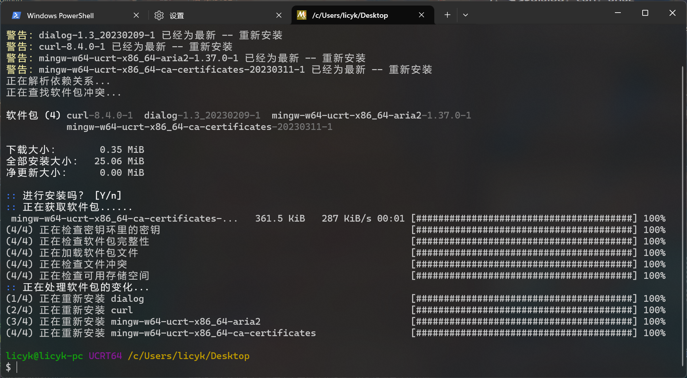

## Windows系统配置Term-SD运行环境的方法：  

### 1、安装 MSYS2
进入 [MSYS2 官网](https://www.msys2.org/)。  
在官网`Installation`找到`1、Download the installer:`，点击右边的按钮进行下载，下载好后打开 MSYS2 安装包，选择好安装的位置后安装。

&nbsp;
<div align="center">

  
`MSYS2 下载页面`  
  
`安装界面`  
  
`先选择安装路径，再点下一步`  
  
`直接下一步`  
  
`安装过程`  

</div>

### 2、安装 Python，Pip  
进入 [Python 官网](https://www.python.org/downloads/release/python-31011/)。  
在 Python3.10 的页面找到`Windows installer (64-bit)`，点击下载。  
打开 Python 安装包，在安装界面点击`customize installation`，然后点击`next`，勾选`Add Python to environment variables`，再点击`browse`，自己选择要安装的位置，选择好后点击`install`，等待安装完成。  
安装结束后先不要关闭安装界面，先点击`Disable path length limit`（没有该选项时则不用理会），再退出。

>[!NOTE]  
>1. Python 安装器在安装 Python 时同时安装 Pip（安装选项中已默认勾选安装 Pip），所以不需要手动再去安装 Pip。  
>2. `Disable path length limit`为启用 Windows 系统的长路径支持，具体查看微软官方文档[《最大路径长度限制》](https://learn.microsoft.com/zh-cn/windows/win32/fileio/maximum-file-path-limitation)，之前已经在 Windows 系统中启用该功能之后，选项`Disable path length limit`将不会显示。

&nbsp;
<div align="center">

  
`官网下载地址`  
  
`安装界面`  
  
  
`先选择安装路径，然后勾选 Add Python to environment variables，再点 Next`  
  
`点击 Disable path length limit（没有该选项时则不用理会）`  

</div>

### 3、配置 Windows 终端  
>[!NOTE]  
>Windows10 需在开始菜单中找到`Micorsoft Store`，搜索`Windows Terminal`进行安装。

右键桌面或者文件管理器空的位置，点击`在终端中打开`，在标题栏点击向下的箭头，打开 Windows 终端设置，点击`添加新配置文件`。  
在`名称`中填入`MSYS2 UCRT64`。  
在`命令行`填入以下内容：

```
C:\msys64\msys2_shell.cmd -defterm -no-start -use-full-path -here -ucrt64 -shell bash
```

在`启动目录`勾选`使用父进程目录`。  
在`图标`填入以下内容

```
C:\msys64\ucrt64.ico
```

>[!NOTE]  
>`C:\msys64`为安装目录，根据具体安装的目录修改。

保存后生效，在标题栏点击向下的箭头就可以看到`MSYS2 UCRT64`，打开后就可以下载和运行 Term-SD（一定要用在`Windows 终端`配置好的`MSYS2 UCRT64`运行 Term-SD，`PowerShell`和`CMD`是没法运行 Term-SD 的）。

>[!NOTE]  
>Windows 终端默认启动 PowerShell，如果想要启动时直接启动`MSYS2 UCRT64`，可以在Windows 终端设置，`启动` -> `默认配置文件`，将`Windows Powershell`改成`MSYS2 UCRT64`，这样每次打开 Windows 终端时默认就会打开 MSYS2 UCRT64。  
>如果要用 MSYS2 安装程序安装的`MSYS2 UCRT64`终端也可以，使用前需要手动编辑`/etc/profile`文件里的`MSYS2_PATH`变量，将 Python 添加进去，因为 MSYS2 安装的`MSYS2 UCRT64`终端并不会读取`系统属性`里设置的变量，或者在启动 Term-SD 时加上`--set-python-path`启动参数来指定 Python 的路径。

&nbsp;
<div align="center">

  
  
  
`红色划线处为必填选项，蓝色划线处为选填项，填完后保存`  

</div>

### 4、配置 MSYS2 镜像源

配置好 Windows 终端后在 Windows 终端的顶栏菜单里找到`MSYS2 UCRT64`，打开  
在`MSYS2 UCRT64`终端输入以下内容并回车。
```bash
sed -i "s#https\?://mirror.msys2.org/#https://mirrors.tuna.tsinghua.edu.cn/msys2/#g" /etc/pacman.d/mirrorlist*
pacman -Sy
```

&nbsp;
<div align="center">

  
`启动 MSYS2`  
  
`配置 MSYS2 镜像源`

</div>

### 5、安装 Git，Dialog，Curl，Aria2
输入以下内容并回车。

```bash
pacman -S git mingw-w64-ucrt-x86_64-git-lfs dialog curl mingw-w64-ucrt-x86_64-aria2 mingw-w64-ucrt-x86_64-ca-certificates
```
输入`y`，回车，等待安装完成

&nbsp;
<div align="center">

  
`安装 Git，Dialog，Curl，Aria2`

</div>

完成上面的步骤后环境就配置好了，可以在下面的步骤下载和启动 Term-SD。

***

## 配置完环境后使用 Term-SD 的方法：  
### 1、打开终端  
打开 Windows 文件管理器，进入 D 盘，E 盘之类的盘符（不要进入 C 盘，小心安装 AI 软件后 C 盘的空间消失），选择合适的安装路径（或者创建一个文件夹并进入），右键文件管理器空白处，选择“在终端中打开”（不要在桌面右键打开终端，因为终端启动的位置决定了 Term-SD 产生文件的位置，除非会使用 cd 命令切换路径），然后启动配置好的`MSYS2 UCRT64`（之后都需要用`MSYS2 UCRT64`启动 Term-SD）。

>[!NOTE]
>Term-SD 已支持修改 AI 软件的安装路径，可以在 Term-SD 的`Term-SD 设置` -> `自定义安装路径`中设置，该功能的说明在[《如何使用 Term-SD》](https://github.com/licyk/README-collection/blob/main/term-sd/README_how_to_use_term_sd.md)。

<div align="center">

  
`右键文件管理器空白处，选择“在终端中打开”，并在 Windows 终端打开“MSYS2 UCRT64”`
  
`终端打开的位置决定了接下来下载文件的路径，也可以用“cd”命令切换到别的目录`

</div>

### 2、下载 Term-SD
在 MSYS2 UCRT64 终端输入以下命令下载 Term-SD。
```bash
aria2c https://github.com/licyk/term-sd/raw/main/term-sd.sh
```
&nbsp;
<div align="center">

  

</div>

如果下载失败可以打开科学上网，再输入刚才的指令，或者使用 Gitlab 仓库地址下载。
```bash
aria2c https://gitlab.com/licyk/term-sd/-/raw/main/term-sd.sh
```

>[!NOTE]  
>1. term-sd.sh 文件所在位置决定了 Term-SD 安装路径和 Term-SD 安装 AI 软件的路径，所以要选好一个自己想要安装的路径再下载，当然也可以把 term-sd.sh 文件移到其他位置。  
>2. Term-SD 已支持修改 AI 软件的安装路径，可以在 Term-SD 的`Term-SD 设置` -> `自定义安装路径`中设置，该功能的说明在[《如何使用Term-SD》](https://github.com/licyk/README-collection/blob/main/term-sd/README_how_to_use_term_sd.md)。

&nbsp;
<div align="center">

  

</div>

### 3、启动 Term-SD
在 MSYS2 终端输入以下命令启动 Term-SD。
```bash
./term-sd.sh
```

启动后按照提示安装 Term-SD 组件后即可正常使用。  
每次启动一定要在 Term-SD 所在目录才能启动，除非使用`term_sd`命令或者`tsd`命令启动。  
而这些快捷命令需要通过`--quick-cmd`启动参数进行安装。  

&nbsp;
<div align="center">

  
`终端显示的路径为 Term-SD 的下载路径和 Term-SD 安装 AI 软件的路径。如果需要切换终端路径，可使用“cd”命令`

</div>

### ！操作 Term-SD 界面前请阅读[《Term-SD 界面操作方法》](https://github.com/licyk/README-collection/blob/main/term-sd/README_how_to_use_dialog.md)
### ！Term-SD 的使用方法请阅读[《如何使用 Term-SD》](https://github.com/licyk/README-collection/blob/main/term-sd/README_how_to_use_term_sd.md)
