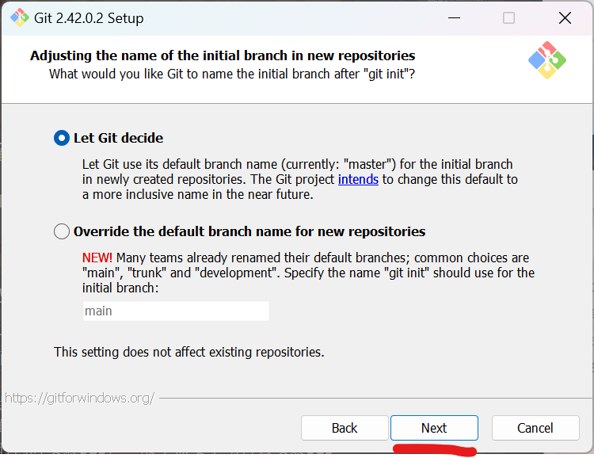

## Windows系统配置Term-SD运行环境的方法：  

### 1、安装msys2  
进入[msys2官网](https://www.msys2.org/)  
在官网`Installation`找到`1、Download the installer:`，点击右边的按钮进行下载并安装  

&nbsp;
<div align="center">

  
`msys2下载页面`  
  
`安装界面`  
  
`先选择安装路径，再点下一步`  
  
`直接下一步`  
  
`安装过程`  

</div>

### 2、安装git  
进入[git官网](https://git-scm.com/download/win)  
在Download for Windows页面找到`64-bit Git for Windows Setup.`，点击下载  
打开git安装包，在安装界面自己选择要安装的位置，选择好后一直点击下一步，直至安装完成  

>这里不用MSYS2安装git，这是因为如果要在绘世启动器，powershell，cmd使用git，需要将MSYS2添加到环境变量，在这步出错容易导致系统出问题，所以改用手动下git安装包来安装  
如果你完全不担心这种问题并且有足够的能力解决电脑系统问题，可以用MSYS2安装git，并将MSYS2添加到环境变量中

&nbsp;
<div align="center">

  
`官网下载地址`  
  
`安装界面`  
  
`先选择安装路径，再点Next`  
  
 `一直点Next`  
  
  
  
  
  
  
  
  
  
  
  
  
`点Install就开始安装了`  

</div>

### 3、安装python，pip  
进入[python官网](https://www.python.org/downloads/release/python-31011/)    
在python3.10的页面找到`Windows installer (64-bit)`，点击下载  
打开python安装包，在安装界面点击`customize installation`，然后点击`next`，勾选`Add Python to environment variables`，再点击`browse`，自己选择要安装的位置，选择好后点击`install`，等待安装完成  
安装结束后先不要关闭安装界面，先点击`Disable path length limit`（没有该选项时则不用理会），再退出 
>1、python安装器在安装python时同时安装pip（安装选项中已默认勾选安装pip），所以不需要手动再去安装pip  
>2、`Disable path length limit`为启用Windows系统的长路径支持，具体查看微软官方文档[《最大路径长度限制》](https://learn.microsoft.com/zh-cn/windows/win32/fileio/maximum-file-path-limitation)，之前已经在Windows系统中启用该功能之后，选项`Disable path length limit`将不会显示

&nbsp;
<div align="center">

  
`官网下载地址`  
  
`安装界面`  
  
  
`先选择安装路径，然后勾选Add Python to environment variables，再点Next`  
  
`点击Disable path length limit（没有该选项时则不用理会）`  

</div>

### 4、配置Windows终端  

>Windows10需在开始菜单中找到`Micorsoft Store`，搜索`Windows Terminal`进行安装

右键桌面或者文件管理器空的位置，点击`在终端中打开`，在标题栏点击向下的箭头，打开Windows终端设置，点击`添加新配置文件`  
在`名称`中填入`MSYS2 UCRT64`  
在`命令行`填入  
```
C:\msys64\msys2_shell.cmd -defterm -no-start -use-full-path -here -ucrt64 -shell bash
```
在`启动目录`勾选`使用父进程目录`  
在`图标`填入
```
C:\msys64\ucrt64.ico
```
>`C:\msys64`为安装目录，根据具体安装的目录修改

保存后生效，在标题栏点击向下的箭头就可以看到`MSYS2 UCRT64`，打开后就可以下载和运行Term-SD（一定要用在`Windows终端`配置好的`MSYS2 UCRT64`运行Term-SD，`powershell`和`cmd`是没法运行Term-SD的）
>Windows终端默认启动powershell，如果想要启动时直接启动`MSYS2 UCRT64`，可以在Windows终端设置，`启动`->`默认配置文件`，将`Windows Powershell`改成`MSYS2 UCRT64`，这样每次打开Windows终端时默认就会打开MSYS2 UCRT64  
如果要用MSYS2安装程序安装的`MSYS2 UCRT64`终端也可以，使用前需要手动编辑`/etc/profile`文件里的`MSYS2_PATH`变量，将aria2c，python添加进去，因为MSYS2安装的`MSYS2 UCRT64`终端并不会读取`系统属性`里设置的变量

&nbsp;
<div align="center">

  
  
  
`红色划线处为必填选项，蓝色划线处为选填项，填完后保存`  

</div>

### 5、配置MSYS2镜像源

配置好Windows终端后在Windows终端的顶栏菜单里找到`MSYS2 UCRT64`，打开  
在`MSYS2 UCRT64`终端输入以下内容并回车
```bash
sed -i "s#https\?://mirror.msys2.org/#https://mirrors.tuna.tsinghua.edu.cn/msys2/#g" /etc/pacman.d/mirrorlist*
pacman -Sy
```

&nbsp;
<div align="center">

  
`启动MSYS2`  
  
`配置MSYS2镜像源`

</div>

### 7、安装dialog，curl，aria2
```
pacman -S dialog curl mingw-w64-ucrt-x86_64-aria2 mingw-w64-ucrt-x86_64-ca-certificates
```
输入y，回车，等待安装完成
>`mingw-w64-ucrt-x86_64-ca-certificates`这个包如果不装会导致aria2下载时出现`ssl/tls handshake failure: unable to get local issuer certificate`

&nbsp;
<div align="center">

  
`安装dialog，curl，aria2`

</div>

完成上面的步骤后环境就配置好了，可以在下面的步骤下载和启动Term-SD  

***

## 配置完环境后使用Term-SD的方法：  
### 1、打开终端  
打开Windows文件管理器，进入D盘，E盘之类的盘符（不要进入C盘，小心安装ai软件后C盘的空间消失），选择合适的安装路径（或者创建一个文件夹并进入），右键文件管理器空白处，选择“在终端中打开”（不要在桌面右键打开终端，因为终端启动的位置决定了Term-SD产生文件的位置，除非会使用cd命令切换路径），然后启动配置好的`MSYS2 UCRT64`（之后都需要用`MSYS2 UCRT64`启动Term-SD）
>Term-SD已支持修改AI软件的安装路径，可以在Term-SD的`设置`->`自定义安装路径`中设置，该功能的说明在[《如何使用Term-SD》](https://github.com/licyk/README-collection/blob/main/term-sd/README_how_to_use_term_sd.md)

<div align="center">

  
`右键文件管理器空白处，选择“在终端中打开”，并在Windows终端打开“MSYS2 UCRT64”`
  
`终端打开的位置决定了接下来下载文件的路径，也可以用“cd”命令切换到别的目录`

</div>

### 2、下载Term-SD
在MSYS2终端输入以下命令下载Term-SD
```bash
aria2c https://github.com/licyk/term-sd/raw/main/term-sd.sh && chmod +x term-sd.sh
```
&nbsp;
<div align="center">

  

</div>

如果下载失败可以打开科学上网，再输入刚才的指令，或者使用gitlab仓库地址下载  
```bash
aria2c https://gitlab.com/licyk/term-sd/-/raw/main/term-sd.sh && chmod +x term-sd.sh
```
&nbsp;
<div align="center">

  

</div>

### 3、启动Term-SD
在MSYS2终端输入以下命令启动Term-SD
```bash
./term-sd.sh
```
启动后按照提示安装Term-SD组件后即可正常使用，如果下载失败就更换其他下载源  
每次启动一定要在Term-SD所在目录才能启动，除非使用“termsd”命令或者“tsd”命令启动（需要通过--quick-cmd启动参数进行安装）  

&nbsp;
<div align="center">

  
`终端显示的路径为Term-SD的下载路径和Term-SD安装ai软件的路径。如果需要切换终端路径，可使用“cd”命令`

>Term-SD已支持修改AI软件的安装路径，可以在Term-SD的`设置`->`自定义安装路径`中设置，该功能的说明在[《如何使用Term-SD》](https://github.com/licyk/README-collection/blob/main/term-sd/README_how_to_use_term_sd.md)

</div>

### ！操作Term-SD界面前请阅读[《Term-SD界面操作方法》](https://github.com/licyk/README-collection/blob/main/term-sd/README_how_to_use_dialog.md)
### ！Term-SD的使用方法请阅读[《如何使用Term-SD》](https://github.com/licyk/README-collection/blob/main/term-sd/README_how_to_use_term_sd.md)
