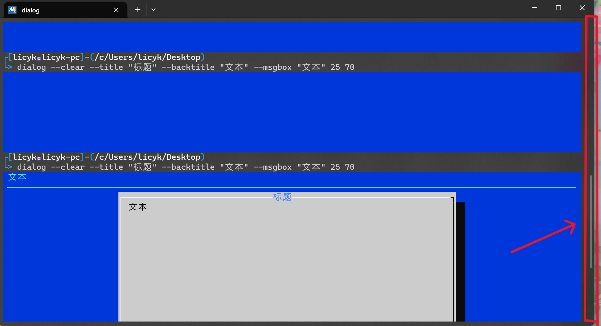
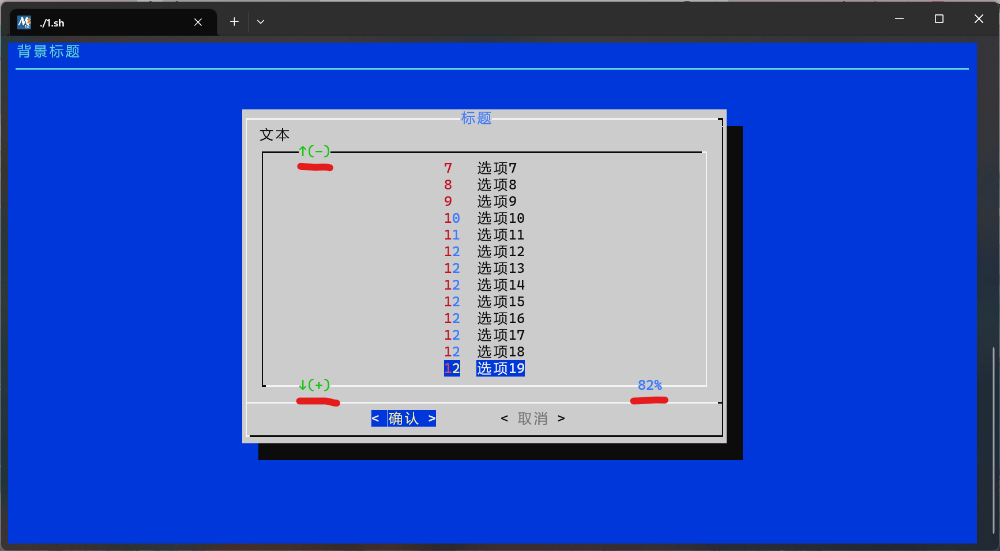
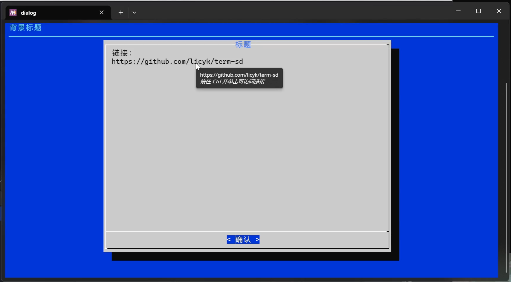
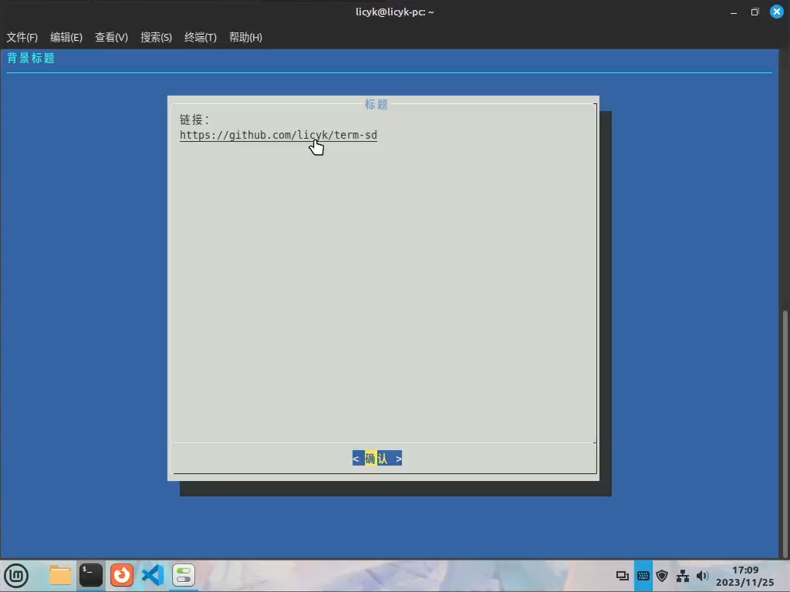

# 关于 Term-SD 操作界面，你需要知道的  

## Term-SD 如何显示界面  
Term-SD 使用 GNU 项目提供的 Dialog 组件来显示图形界面，Dialog 为用户提供文本用户界面（TUI）。虽然该方式不如图形化界面（GUI）的操作方便，但是可以让用户不需要手动输入命令来进行各项操作。当然，因为在终端中运行的特性，Dialog 甚至可以在 Linux 的 tty 中显示界面  
  

## Dialog 操作方法  
>如果终端的大小太小，可能会造成界面显示不完全，需要将终端的窗口调大

Term-SD 使用了 5 种类型的 Dialog 界面  
使用`方向键`、`Tab键`移动光标，`方向键` / `F`，`B`键翻页(鼠标滚轮无法翻页)，`Enter`键进行选择，`Space`键勾选或取消勾选，(已勾选时显示`[*]`)，`Ctrl+Shift+V`粘贴文本，`鼠标左键`可点击按钮(右键无效)  
当 Dialog 的界面的底下有两个选项时，高亮光标的位置代表选择的`是`或`否`；当只有一个选项时，高亮光标的位置只代表`是`  
如果界面不显示，可以按下任意一个`方向键`（不要按`空格键`，`回车键`，`ESC键`，不然容易导致误操作），Dialog 的界面就会显示出来（有时候 Dialog 会有这种不显示界面的 Bug，仅在 Windows 系统上发现过）

### 1、信息展示界面  
  
该界面只有一个展示界面和一个确认按钮，用于展示大量的文本信息  

### 2、输入界面  
  
该界面有一个输入框和确认，取消按钮，用于输入信息，粘贴内容的快捷键不能使用`Ctrl+V`，要使用`Ctrl+Shift+V`  

### 3、是否选择界面  
  
该界面有是，否选择按钮，用于确认用户的选择  

### 4、复选界面  
  
该界面提供多个带有勾选框的选项，用于提供勾选功能，已勾选的选项显示`[*]`  

### 5、选择界面  
  
该界面提供多个选项，用于提供选择  

## 终端特殊用法
### 1、查看之前的输出
  
在图形化界面使用的终端，如 Windows 终端，MSYS2 终端，Gnome 终端，Konsole 终端等(非 tty 终端)，在右边都会带有可以上下翻页的滚动条，在 Dialog 界面显示显示出来后，如果想要查看之前的命令输出内容，就可以用鼠标按住滚动条向上滑。回到原来的 Dialog 界面就滑到最下面，或者按下任意一个方向键（不要按空格键，回车键，ESC 键，不然容易导致误操作），也可以回到原来的 Dialog 界面

### 2、界面提示
  
当 Dialog 界面高度不足，无法显示全部内容时，会出现上面的提示，用户可以通过方向上 / 下键来显示被隐藏的内容

### 3、打开链接
部分终端支持显示链接提示（在链接下方显示下划线），当鼠标光标移至链接上时，终端会提示这是链接并允许用户使用`Ctrl+鼠标左键`打开链接  

  
`Windows 终端`  
  
`Gnome 终端`  

