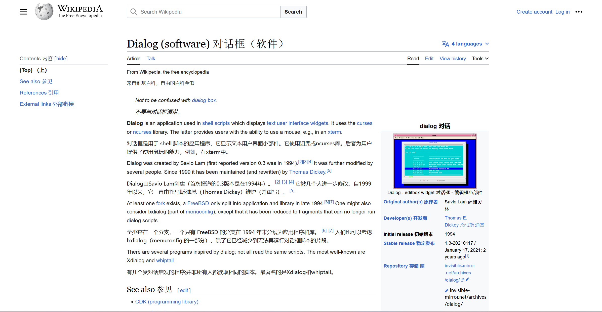
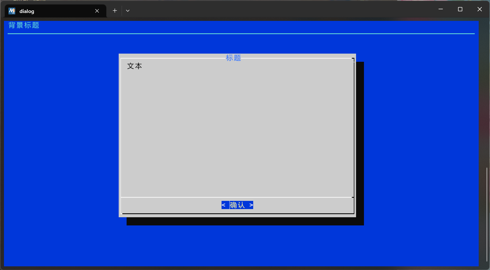
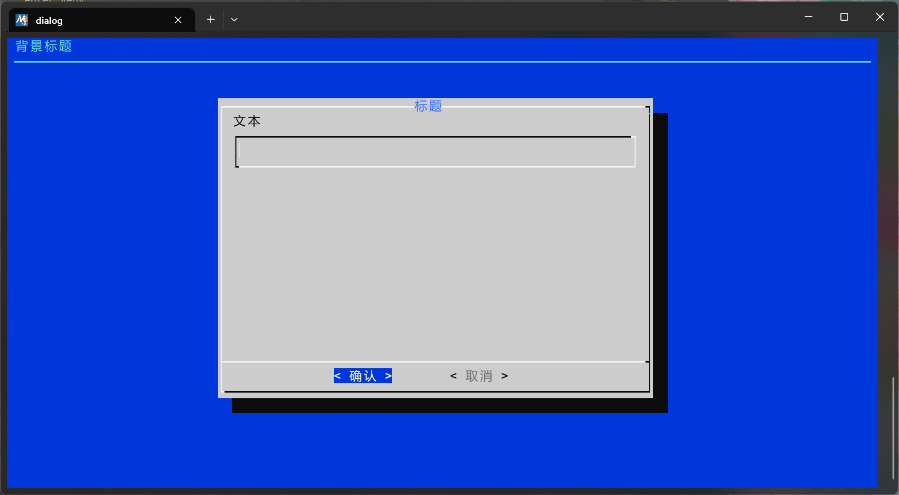
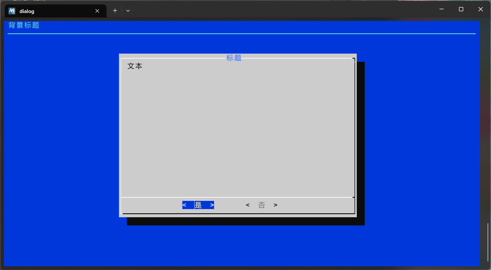
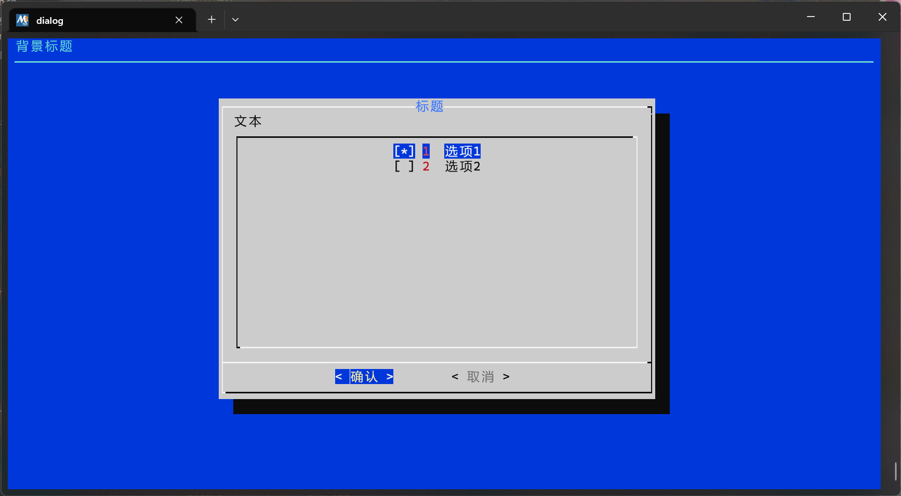
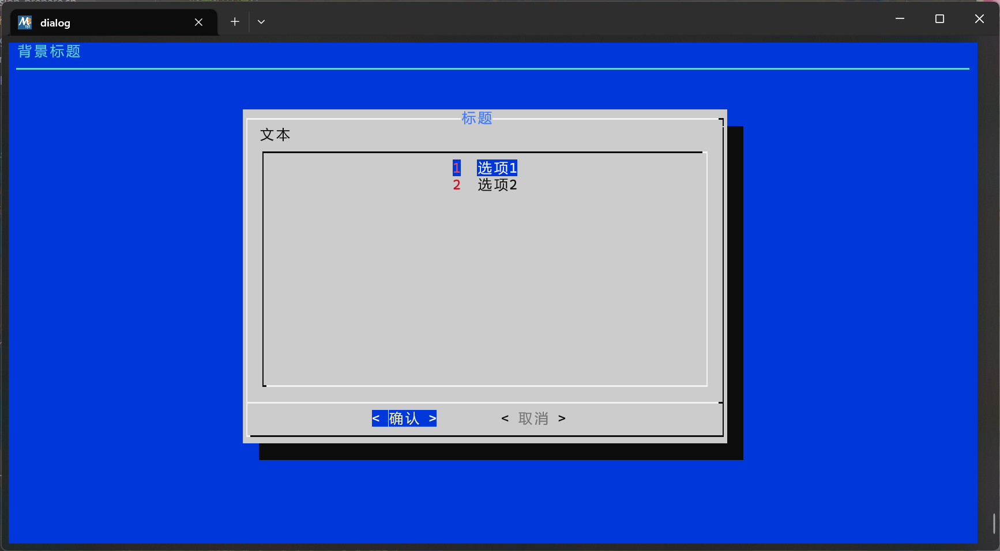

## 关于Term-SD操作界面，你需要知道的  

### Term-SD如何显示界面  
Term-SD使用GNU项目提供的dialog组件来显示图形界面，dialog为用户提供文本用户界面（TUI）。虽然该方式不如图形化界面（GUI）的操作方便，但是可以让用户不需要手动输入命令来进行各项操作。当然，因为在终端中运行的特性，dialog甚至可以在linux的tty中显示界面  
  

### dialog操作方法  
Term-SD使用了5种类型的dialog界面  
使用方向键、Tab键移动光标,方向键翻页(鼠标滚轮无法翻页),Enter进行选择,Space键勾选或取消勾选,(已勾选时显示[*]),Ctrl+Shift+V粘贴文本，鼠标左键可点击按钮(右键无效)  
当dialog的界面的底下有两个选项时，高亮光标的位置代表选择的“是”或否；当只有一个选项时，高亮光标的位置只代表“是”  

#### 1、信息展示界面  
  
该界面只有一个展示界面和一个确认按钮，用于展示大量的文本信息  

#### 2、输入界面  
  
该界面有一个输入框和确认，取消按钮，用于输入信息，粘贴内容的快捷键不能使用`Ctrl+V`，要使用`Ctrl+Shift+V`  

#### 3、是否选择界面  
  
该界面有是，否选择按钮，用于确认用户的选择  

#### 4、复选界面  
  
该界面提供多个带有勾选框的选项，用于提供勾选功能，已勾选的选项显示[*]  

#### 5、选择界面  
  
该界面提供多个选项，用于提供选择  

### 终端特殊用法
需要添加图片
在图形化界面使用的终端，如Windows终端，MSYS2终端，gnome终端，konsole终端等(非tty终端)，在右边都会带有可以上下翻页的滚动条，在dialog界面显示显示出来后，如果想要查看之前的命令输出内容，就可以用鼠标按住滚动条向上滑。回到原来的dialog界面就滑到最下面